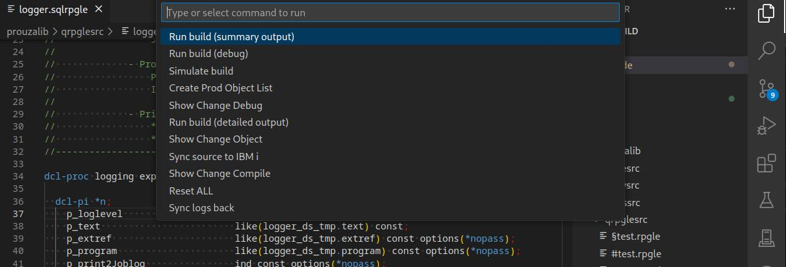
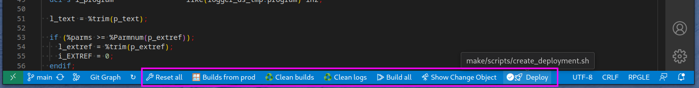
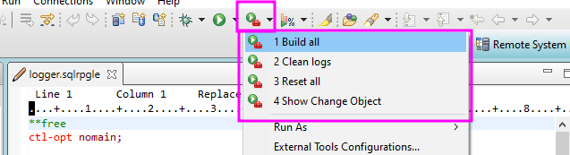
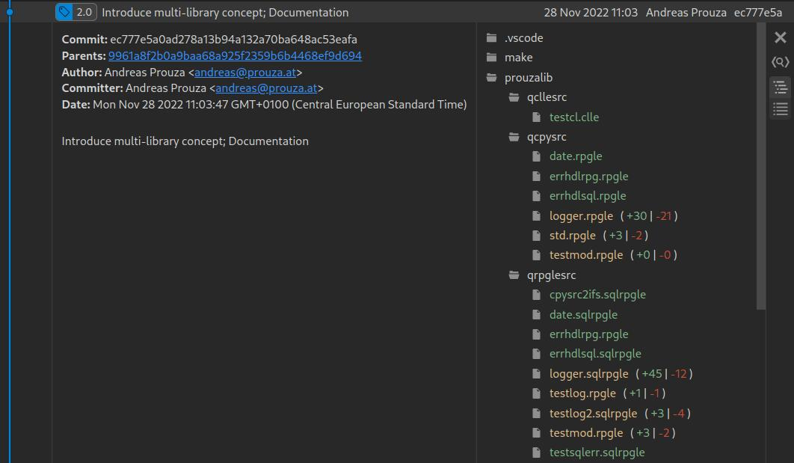
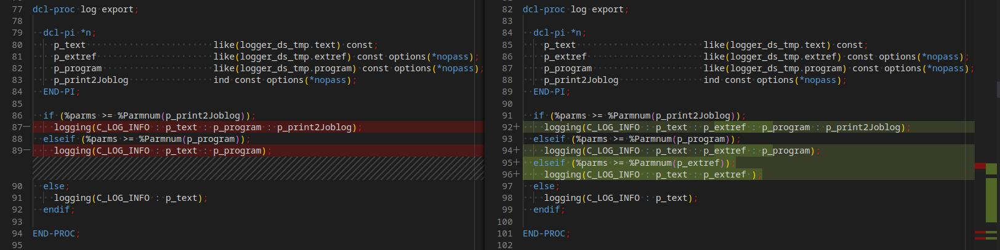
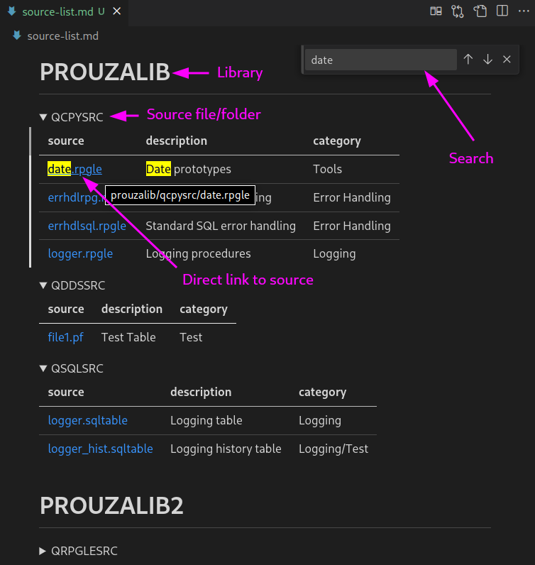

#  Object Builder for i (OBI)

* [Quick Start](/docs/pages/quick_start.md)
* [The concept](/docs/pages/concept.md)
* [Configuration](/docs/pages/configuration.md)


## Features

* Check for changes
  
  It checks all sources which have changed since last compilie.  
  The hash value of the source will be used to check if it has changed.
  
* Check for dependencies
  
  All objects which depend on the changed source will also be compiled (in correct order)

  E.g. if a table or view has changed, all objects which use them will be compiled too

* Compile in correct order
  
  Tables before programs etc. based on the dependency list

* All actions can be done in you IDE (RDi or vscode)  
  * Visual Studio Code
    * Using short cuts

      
  
    * Or action buttons

      

  * RDi

    Using external tools

    

* Fast performance

  You can use the power of your local PC to get the build prepeared.<br/>
  This significantly improves performance.<br/>
  This is particularly important if the network and/or development partition are slow.

* See which objects has been compiled and their details  
  Each task has its own:
  
  * joblog
  * spool file
  * error output
  
  


**If you also want to use git with that you will benefit all its advantages:**

* Work with branches
* Version control

  

* Integration in other tools like Atlassian JIRA
* Compare between different versions

  

* Extended source list(s)  
  
  Because sources are located in the IFS you may miss the source description text from PDM.

  * You can use a source list containing all sources and the related text description from the source files.
  * Create multiple source lists for different projects/areas.  
    You can also use it to filter your sources
  * Extend the list with further information like
    * Category
    * Link to wiki or ticket
    * Department
    * etc.
  * This source list can be automatically generated (e.g. via SQL)

  


# FAQ

## Error on build run

### Problem

```sh
###################################################  
2024-05-14 07:49:21.728 ... run_build.sh 
################################################### 

 finished sync to logsolution-test 
Open compile summary
Run compile commands ...
 finished sync back logs and build files 
 Error occured! 

 bash: line 1: /usr/prouza/obi/venv/bin/python: No such file or directory 
```

### Cause

Either OBI does not exist or you forget to run the setup  
https://github.com/andreas-prouza/obi

### Solution

Run ...
```sh
cd /usr/prouza/obi
./setup.sh
```